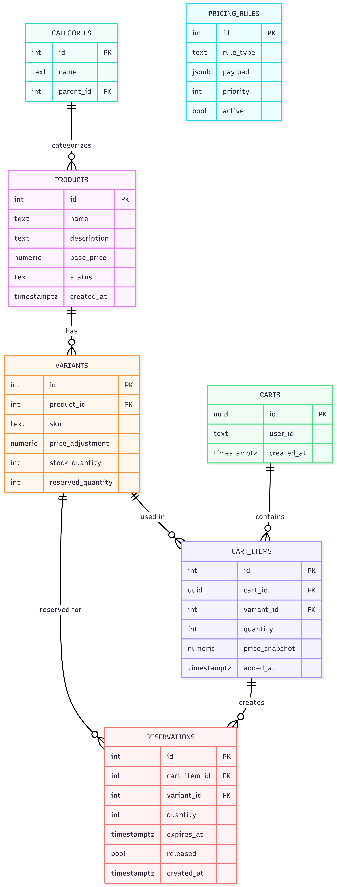
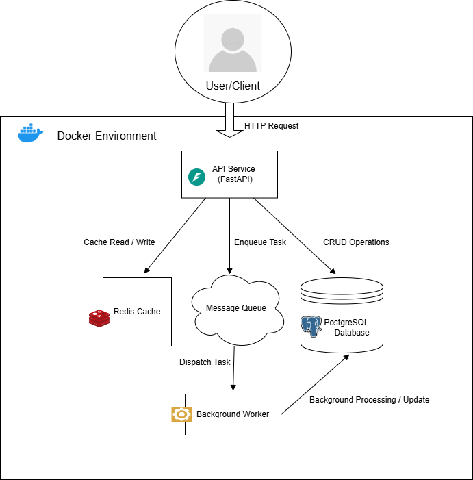

# E‑Commerce Inventory & Pricing API

A modular **E‑Commerce Backend API** built using **FastAPI**, **PostgreSQL**, **Redis**, **Docker**, and a background **Worker** service.

This project implements core backend features: products and variants, cart items with **reservations**, dynamic **pricing rules**, and a transactional **checkout** workflow.

---

## Features

### 🔹 Core Features

- Product and variant creation & listing  
- Cart creation and cart item reservation  
- Pricing rules engine (base price → discounts)  
- Reservation & checkout workflow with stock and reserved quantities  
- PostgreSQL as primary database  
- Redis as broker/cache for background worker  

### 🔹 Background Processing

- Celery worker for:
  - Cleaning up **expired reservations**
  - Releasing reserved stock back to available inventory  

---

##  System Architecture


<p align="center">
  
</p>


<p align="center">
  
</p>

---

##  Components

### API Service

- FastAPI application exposing `/api/v1/...` endpoints:
  - Products & variants
  - Carts & cart items
  - Checkout

### PostgreSQL

- Stores:
  - `products`, `variants` (with `stock_quantity` and `reserved_quantity`)
  - `carts`, `cart_items` (with `reserved_until` and price snapshots)
  - `orders`, `order_items`
  - `pricing_rules` and related tables

### Redis

- Message broker for Celery worker tasks.

### Worker Service

- Periodically scans for **expired reservations**:
  - Decrements `reserved_quantity` on variants
  - Removes expired `cart_items`

### Docker Compose

- Orchestrates:
  - `api` (FastAPI)
  - `db` (PostgreSQL)
  - `redis`
  - `worker` (Celery)

---

## Tech Stack

| Layer            | Technology              |
| ---------------- | ----------------------- |
| Backend API      | FastAPI (Python)        |
| Worker Service   | Celery                  |
| Database         | PostgreSQL              |
| Queue / Broker   | Redis                   |
| Containerization | Docker + Docker Compose |
| API Docs         | Swagger (OpenAPI)       |
| Testing          | curl / HTTP clients     |

---

## Project Structure
```
ecom-api/
├── app/
│ ├── main.py
│ ├── db.py
│ ├── models.py
│ ├── api/
│ │ └── v1/
│ │ ├── products.py
│ │ ├── carts.py
│ │ └── checkout.py
│ ├── services/
│ │ ├── pricing.py
│ │ └── reservations.py
│ ├── celery_app.py
│ └── tasks.py
├── migrations/
│ └── 0001_init.sql
├── schema.png
├── architecture.png
├── docker-compose.yml
├── Dockerfile
├── requirements.txt
└── README.md
```
---


## Environment Variables

Create a `.env` file (or configure environment in Docker):
```
DATABASE_URL=postgresql://postgres:postgres@db:5432/ecom
REDIS_URL=redis://redis:6379/0
SECRET_KEY=your-secret-key
```

---

## 🐳 Running the Project (Docker)

###  Start all services
```
docker compose up --build
```
###  Apply initial schema

This project uses a **SQL migration file**, not Alembic.
```
docker compose exec -T db psql -U postgres -d ecom -f /migrations/0001_init.sql
```
###  Worker

The Celery worker is started by Docker Compose.  
If needed manually:
```
docker compose exec -T api celery -A app.celery_app worker -l info
```
---

## API Access

### Swagger UI

http://localhost:8000/docs

---

### Example Endpoints

- `POST /api/v1/products`
- `POST /api/v1/variants`
- `POST /api/v1/carts`
- `POST /api/v1/carts/{cart_id}/items`
- `POST /api/v1/checkout`

---

##  API Testing (Examples)

### 🔸 Add Item to Cart (Reserve Stock + Apply Pricing)
```
curl -X POST "http://127.0.0.1:8000/api/v1/carts/6/items"
-H "Content-Type: application/json"
-d '{
"variant_id": 1,
"quantity": 2,
"user_tier": "gold",
"promo_code": null
}'
```

### 🔸 Checkout
```
curl -X POST "http://127.0.0.1:8000/api/v1/checkout"
-H "Content-Type: application/json"
-d '{
"cart_id": 6,
"user_id": 1
}'
```
---

## Reservation Logic

- **Stock is not immediately deducted.**
- Each cart item has a `reserved_until` timestamp.
- Adding items:
  - Increases `reserved_quantity` on the variant.
- Checkout:
  - Ensures reservation still valid.
  - Ensures `reserved_quantity` and `stock_quantity` are sufficient.
  - Deducts from `stock_quantity` and clears `reserved_quantity` for purchased items.
- Background worker:
  - Releases **expired** reservations:
    - Decrements `reserved_quantity`.
    - Deletes expired `cart_items`.
- This design helps prevent overselling under concurrency.

---

## Database Migrations

Currently, schema is managed with a **single SQL file**:
```
docker compose exec -T db psql -U postgres -d ecom -f /migrations/0001_init.sql
```

## Local Development (Without Docker)
```
python -m venv venv

source venv/bin/activate # Windows: venv\Scripts\activate
```
```
pip install -r requirements.txt
```

ensure local Postgres + Redis are running and DATABASE_URL / REDIS_URL are set
```
uvicorn app.main:app --reload
```


